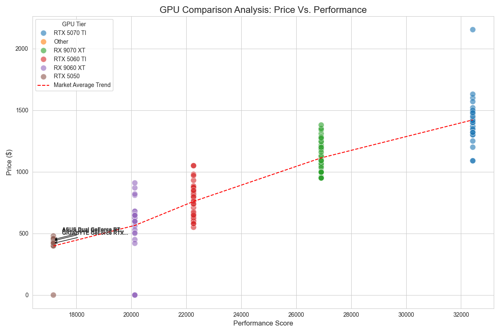

# GPU-Comparison-Analysis-Project

Project Overview
I've been in the market for a new graphics card as it is one of my new goals to build a gaming PC! I have been eyeing the NVIDIA RTX 5050, RTX 5060 TI, RTX 5070 TI, AMD RX 9060 XT, and the RX 9070 XT. However, I am not sure which of these graphics cards are really worth it. This project uses Python, Web Scraping, and Statistical Analysis to identify the most efficient GPUs currently available.

By scraping real-time data from major retailers and cross-referencing it with performance benchmarks, this tool identifies the "Efficient Frontier" of graphics cards.

Key Features
Automated Scraper: Extracts product names and prices from Newegg and Canada Computers.
Data Sanitization: Uses keyword filtering to remove "noise" like full gaming PCs and weird encoding characters.
Outlier Detection: Calculates the Mean and Standard Deviation for each GPU tier to flag overpriced listings.
Value Indexing: Calculates a Price-per-Performance (PPP) score for every listing.
Visualization: Generates a Seaborn scatter plot identifying "Value Kings" and market trends.

The Tech Stack
Data Handling: Pandas, NumPy
Scraping: BeautifulSoup, Requests, Selenium
Visualization: Matplotlib, Seaborn
Other: Numppy, Time

Visualizing the Market
Figure 1: Scatter plot showing the correlation between price and performance benchmarks. The red dashed line represents the market average trend.

Insights Found
The Sweet Spot: The RTX 5050 and RX 9060 XT consistently offer the lowest Price-per-Performance index.
The Enthusiast Tax: High-end cards like the RTX 5070 TI show massive price variance (High STD), indicating that buyers are often paying for "Brand Aesthetics" rather than raw performance gains.
Efficiency Frontier: Listings sitting below the dashed trend line represent "Statistically Significant Deals."
